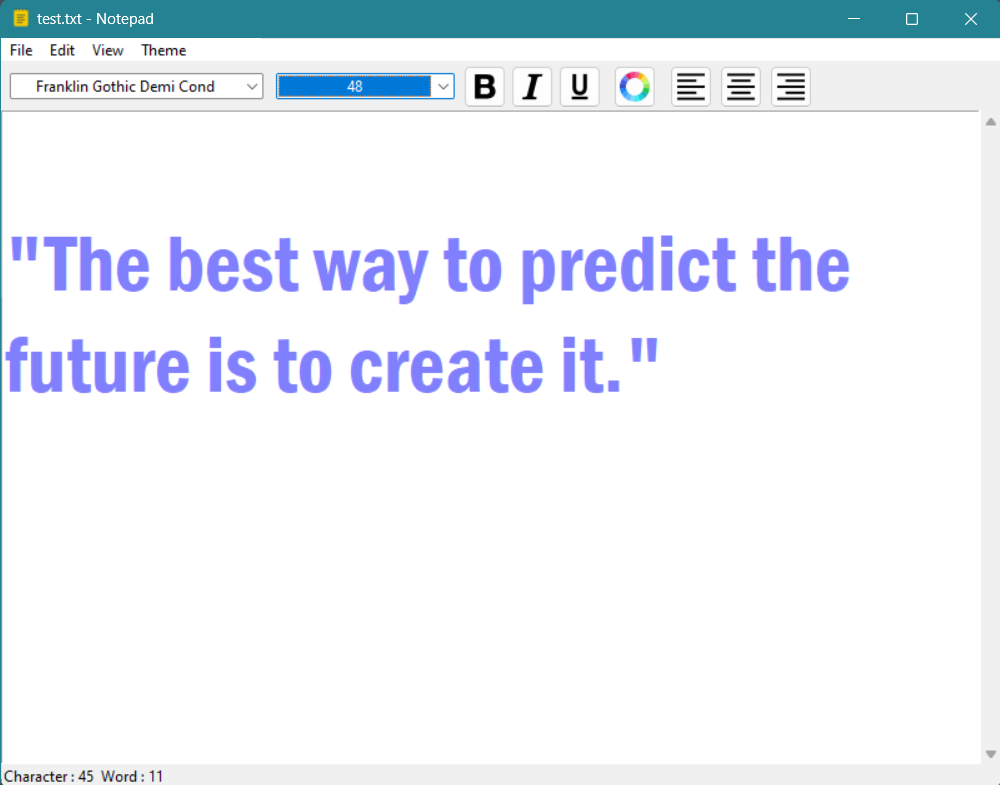
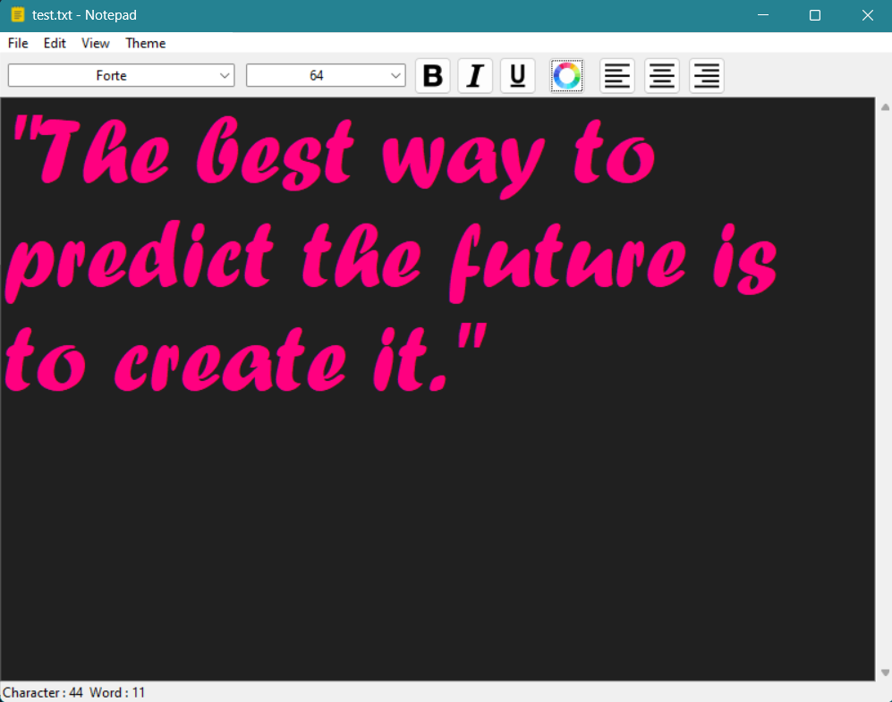

# 📝 Notepad Application

Welcome to the Notepad Application! This project is built using Python and Tkinter, offering a comprehensive set of features for your text editing needs. 🎉

## 📖 Description

The Notepad Application is a simple and efficient text editor developed with Python's Tkinter library. It includes essential file operations, advanced editing tools, customizable themes, and real-time character and word count. Perfect for enhancing productivity and making text editing a breeze.

## ✨ Features

### 📂 File
- **New**: Create a new document.
- **Open**: Open an existing document.
- **Save**: Save the current document.
- **Save As**: Save the document with a new name.
- **Exit**: Exit the application.

### ✂️ Edit
- **Cut**: Cut selected text.
- **Copy**: Copy selected text.
- **Paste**: Paste text from the clipboard.
- **Clear All**: Clear all text.
- **Find/Replace**: Find and replace text.

### 👁️ View
- **Tool Bar**: Show or hide the tool bar.
- **Status Bar**: Show or hide the status bar.

### 🎨 Theme
- **Light**: Light theme for the notepad.
- **Dark**: Dark theme for the notepad.
- **System**: System default theme.

### 🔧 Tool Bar
- **Font Change**: Change the font type.
- **Font Size**: Adjust the font size.
- **Bold**: Make text bold.
- **Italic**: Italicize text.
- **Underline**: Underline text.
- **Text Alignment**: Align text left, center, or right.

### 📊 Status Bar
- **Character Count**: Displays the number of characters.
- **Word Count**: Displays the number of words.

## 🛠️ Installation

1. Clone the repository:
    ```sh
    git clone https://github.com/yourusername/notepad.git
    ```
2. Navigate to the project directory:
    ```sh
    cd notepad
    ```
3. Install the required dependencies:
    ```sh
    pip install -r requirements.txt
    ```
4. Run the application:
    ```sh
    python notepad.py
    ```

## 🚀 Usage

Open the application and start typing! Use the menu options to explore and utilize all the features. Customize your editing experience with various themes and tool bar options. The status bar will keep track of your character and word count in real-time.

## 📸 Screenshots


*Light Theme*


*Dark Theme*

## 🤝 Contributing

Contributions are welcome! Please fork this repository and submit a pull request for any improvements or bug fixes.

## 📜 License

This project is licensed under the MIT License. See the [LICENSE](LICENSE) file for details.

## 📬 Contact

For any questions or suggestions, feel free to contact me at [your-email@example.com](mailto:amankrshawyt@gmail.com).

---

Enjoy using the Notepad Application! ✍️📝✨

---
